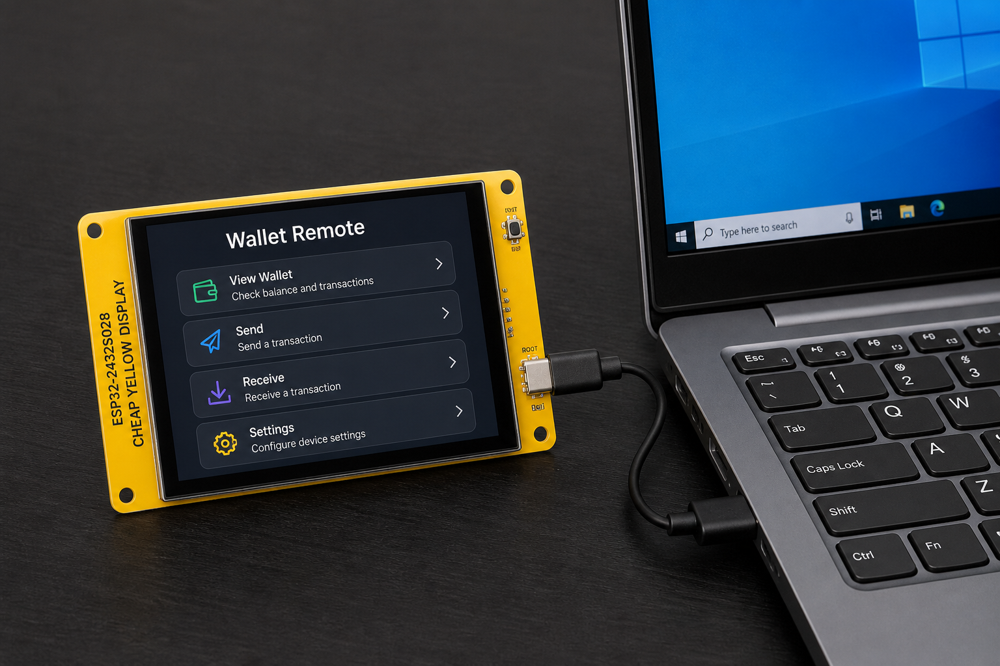
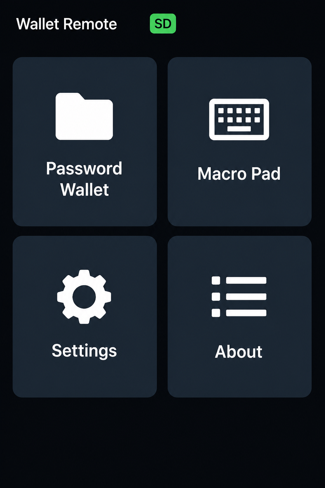
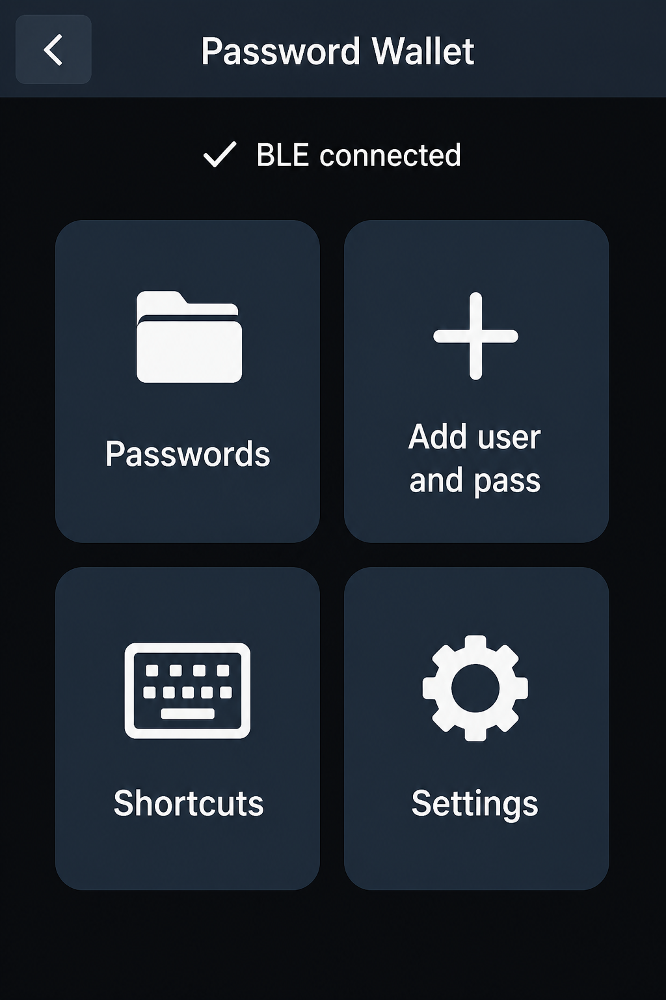
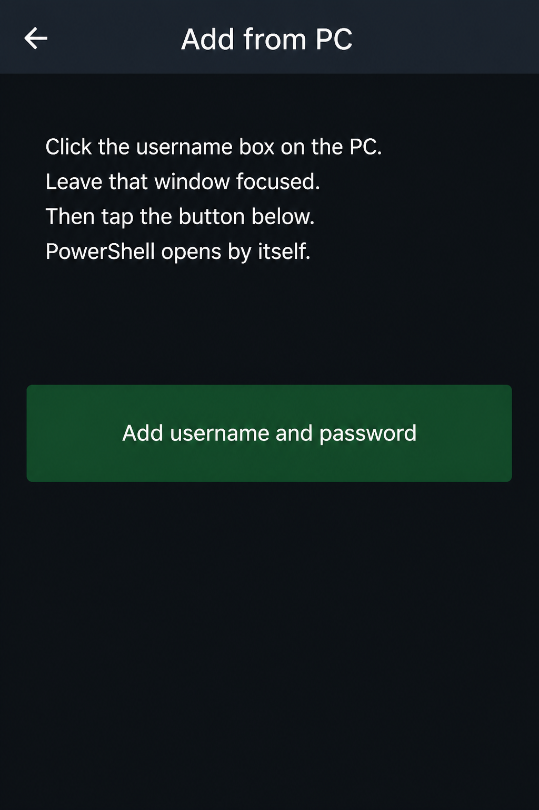
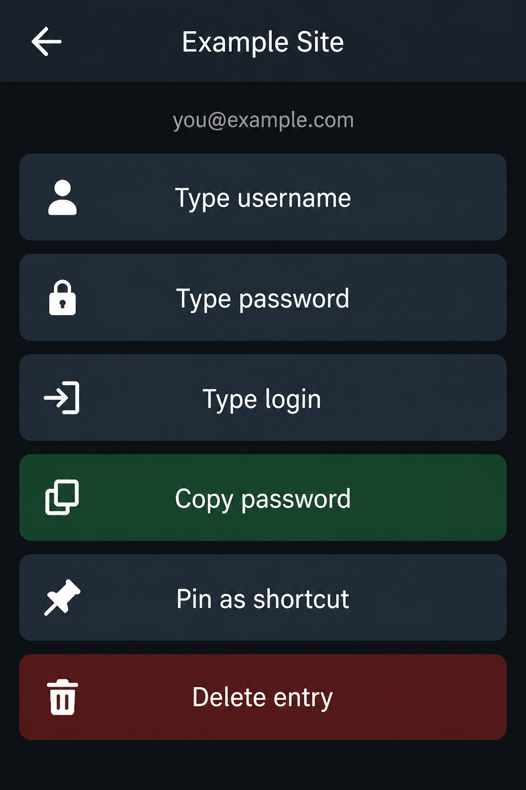
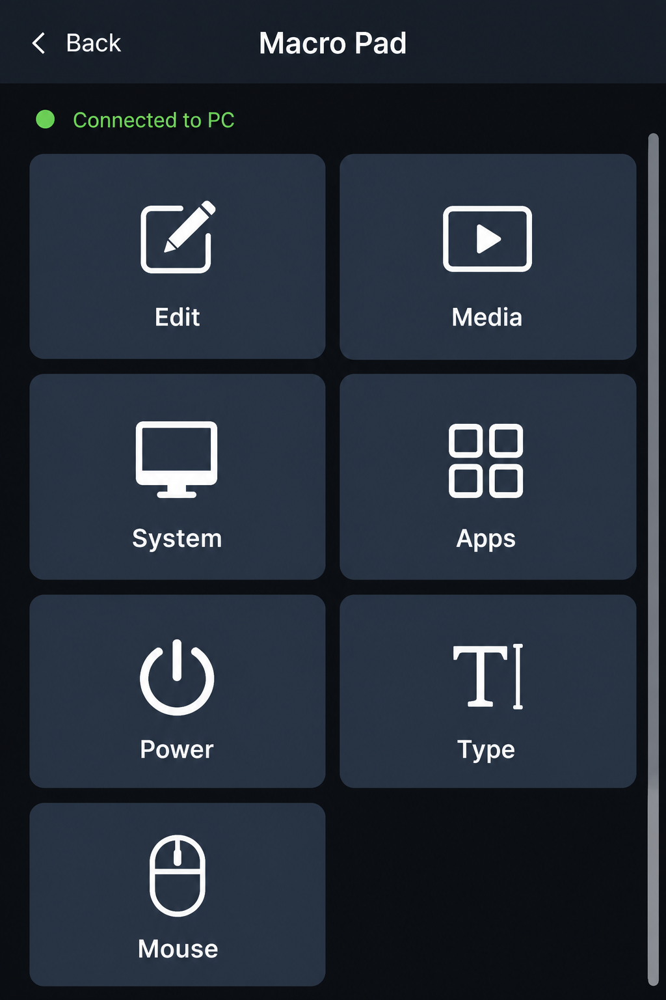
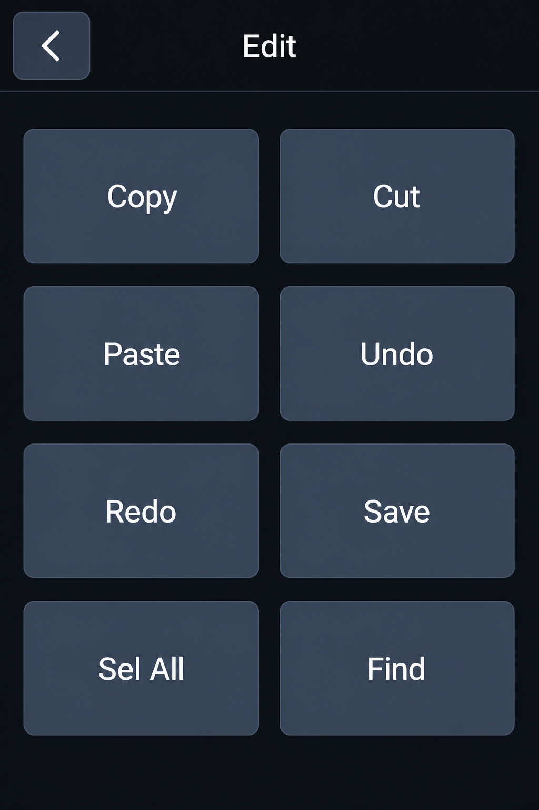
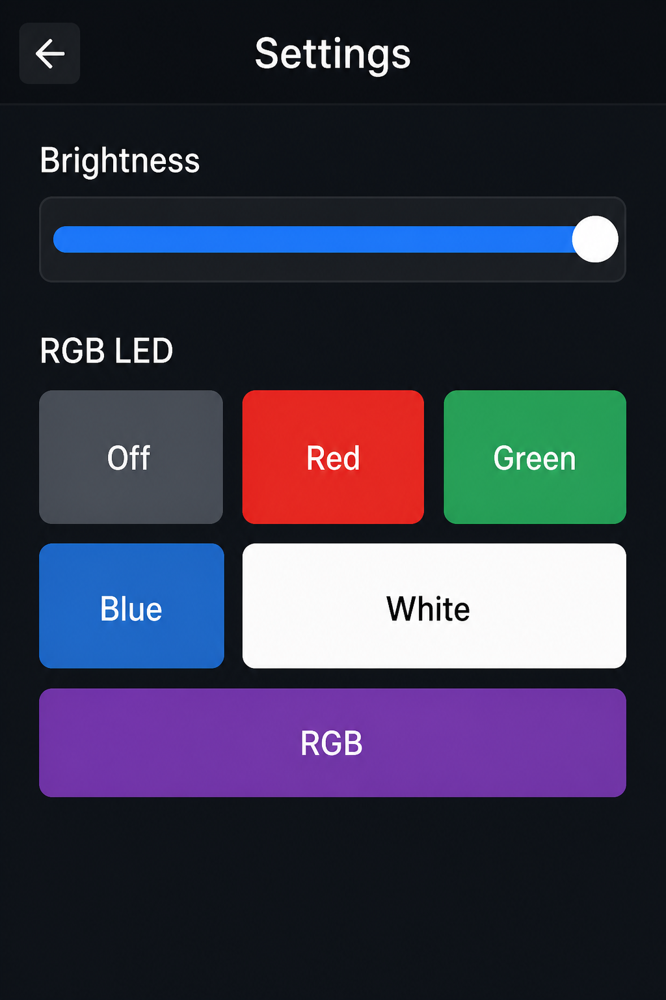

# Wallet Remote tutorial

This guide shows how to flash the firmware and how to use each menu. The pictures are examples of what you see on the 2.8" screen.

Pair the board in Windows as **Wallet Remote**.

## 1. Flash the firmware

You only need a USB cable for this step. After flashing, you can power the board from USB, a power bank, or any 5 V source.



1. Plug the ESP32-2432S028 into the PC.
2. Note the COM port:

   ```powershell
   [System.IO.Ports.SerialPort]::GetPortNames()
   ```

3. From the project folder, build (first time) and flash. Replace `COM4` with your port:

   ```powershell
   powershell -ExecutionPolicy Bypass -File scripts\rebuild.ps1
   powershell -ExecutionPolicy Bypass -File scripts\flash.ps1 COM4
   ```

Flash **`dist/wallet-remote.bin` at address `0x0`**. Do not write the smaller `firmware.bin` at `0x0` — that leaves a black screen.

The firmware is Arduino code: [`arduino/WalletRemote/WalletRemote.ino`](../arduino/WalletRemote/WalletRemote.ino). PlatformIO is the usual way to build it; Arduino IDE steps are in [`ARDUINO_IDE.md`](ARDUINO_IDE.md).

If the board does not reboot, press **RST / EN**.

### One-time helper install (Windows)

The board cannot read the PC clipboard by itself. Install the helper once:

```powershell
powershell -ExecutionPolicy Bypass -File tools\install-helper.ps1
```

That copies the helper to `C:\WalletRemote\`. You do not start it by hand. When you tap copy on the screen, the board launches it over Bluetooth and closes it when it is done.

### MicroSD (recommended)

Format a card as **FAT32**. You can leave it empty (the firmware creates files) or copy the examples from `sd_template/` to the card root:

| File on the card     | What it stores        |
|----------------------|-----------------------|
| `data.json`          | Wallet logins         |
| `shortcuts.json`     | Type-menu snippets    |
| `helper-path.txt`    | Optional helper path  |

## 2. Pair Bluetooth

1. Windows Settings → Bluetooth → add **Wallet Remote**.
2. Keep the website or app you want to type into focused. Do not click a PowerShell window while capturing.

## 3. Home menu

After boot you should see four tiles.



| Tile | What it opens |
|------|----------------|
| **Password Wallet** | Logins on the SD card |
| **Macro Pad** | Keyboard, media, apps, mouse |
| **Settings** | Brightness and RGB LED |
| **About** | Version and heap |

A green **SD** badge means the card mounted. If there is no card, a warning appears and you can still use the Macro Pad.

## 4. Password Wallet

Tap **Password Wallet**. The first time, set an access password (4 or more characters). That hash stays on the ESP32, not on the SD card.



| Tile | Use it to |
|------|-----------|
| **Passwords** | Open a saved login |
| **Add user and pass** | Copy a login from the PC |
| **Shortcuts** | One-tap pinned passwords |
| **Settings** | Change the wallet password |

### Add a login from the PC

1. Click the **username** box on the website. Leave that window focused.
2. On the board, open **Add user and pass**.



3. Tap **Add username and password**. The board starts the helper, copies the username, tabs to the password, copies again, then asks for a shortcut name.
4. If the password field stays empty, show the password on the site (eye icon) and try again, or use **Type manually** from the Passwords list.

### Type or copy a saved login

Open **Passwords**, then tap an entry.



| Button | What it does on the PC |
|--------|-------------------------|
| **Type username** | Types the username into the focused field |
| **Type password** | Types the password |
| **Type login** | Username, Tab, then password |
| **Copy password** | Types it, then Ctrl+A / Ctrl+C |
| **Pin as shortcut** | Adds it to Shortcuts |
| **Delete entry** | Removes it from the SD card |

## 5. Macro Pad

From Home, tap **Macro Pad**. Pair Bluetooth if the status does not say connected.



### Edit (example)

Tap **Edit** for copy, paste, undo, and the other shortcuts.



| Category | Sends |
|----------|--------|
| **Edit** | Copy, Cut, Paste, Undo, Redo, Save, Select All, Find |
| **Media** | Play/Pause, tracks, volume, mute |
| **System** | Snip, record, lock, desktop, task view, Explorer |
| **Apps** | Notepad, Calculator, Browser, Terminal, Steam, Discord |
| **Power** | Shut down, restart, sleep, hibernate, sign out, lock |
| **Type** | On-screen keyboard, copy-save from PC, named snippets |
| **Mouse** | Drag pad plus left and right click |

**Type → Copy save from PC:** select text on the laptop, tap the button. The board copies it and asks for a shortcut name.

## 6. Settings

From Home, tap **Settings**.



- Drag **Brightness** (it will not go fully dark).
- Solid colors: Off, Red, Green, Blue, White.
- **RGB** runs a rainbow cycle like an RGB keyboard. It keeps running after you leave Settings. Tap any other color to stop it.

## Problems

| What you see | What to try |
|--------------|-------------|
| Black screen | Flash `dist/wallet-remote.bin` at `0x0`, not `firmware.bin` |
| Garbled colors | Toggle `TFT_INVERSION_ON` in `platformio.ini` and rebuild |
| Touch is mirrored | Flip `TOUCH_INVERT_X`, `TOUCH_INVERT_Y`, or `TOUCH_SWAP_XY` in `arduino/WalletRemote/config.h` |
| Copy sends nothing | Pair Bluetooth, click the website field, run `tools\install-helper.ps1` once |
| Password did not copy | Many sites block copy on hidden password fields; show the password first |

## Security

Usernames and passwords on the SD card are stored as plain text in `data.json`. Anyone with the card can read them. The unlock password is hashed on the ESP32. Treat the board as a convenience remote, not a hardware security key.
